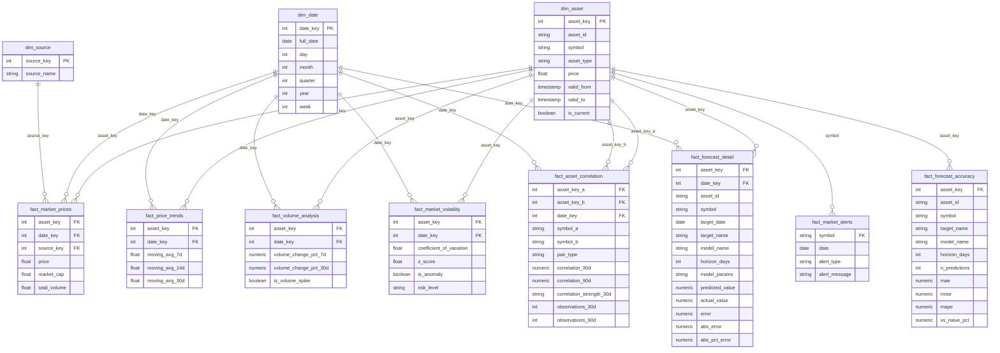

# Crypto Market Analysis Platform

> End-to-end ELT data engineering platform for collecting, transforming and analyzing cryptocurrency and stock market data using Apache Airflow, dbt and PostgreSQL.


---

#  Project Overview

The Crypto Market Analysis Platform is an automated ELT (Extract–Load–Transform) pipeline designed for collecting, processing and analyzing cryptocurrency and stock market data.

The platform integrates multiple financial APIs, stores raw market data inside PostgreSQL and transforms it into a dimensional data warehouse using dbt. Apache Airflow orchestrates the complete workflow, while Docker provides an isolated and reproducible execution environment.

The main objective of the project is to build a scalable analytics platform capable of supporting Business Intelligence dashboards and historical market analysis.

---

#  Project Goals

The platform was designed to:

- Automate financial market data collection
- Build a modern ELT pipeline
- Transform raw API data into analytical datasets
- Track historical dimensional changes using SCD Type 2
- Support incremental daily data ingestion
- Prepare clean datasets for Business Intelligence tools

---

#  System Architecture

```text
                  +--------------------+
                  |    CoinGecko API   |
                  +--------------------+
                             |
                  +--------------------+
                  |    Binance API     |
                  +--------------------+
                             |
                  +--------------------+
                  | Alpha Vantage API  |
                  +--------------------+
                             |
                             ▼
                  Apache Airflow DAG
                  (Pipeline Orchestration)
                             │
                             ▼
                  PostgreSQL Raw Layer
                             │
                             ▼
                   dbt Staging Models
                             │
                             ▼
                dbt Intermediate Models
                             │
                             ▼
                   dbt Marts (Star Schema)
                             │
                             ▼
                   Analytics / BI Layer
```

---

#  Tech Stack

| Technology | Purpose |
|------------|---------|
| Python | Data ingestion |
| PostgreSQL | Data Warehouse |
| Apache Airflow | Workflow orchestration |
| dbt | Data transformations |
| Docker | Containerization |
| SQL | Data modelling |
| Git | Version Control |
| GitHub | Source Code Management |

---

#  Data Sources

The platform integrates data from three independent financial APIs.

Which sources are active and which assets/symbols get pulled from each is **not hardcoded in Python** - it's driven by a `config` schema in PostgreSQL (see [Config-Driven Ingestion](#config-driven-ingestion) below). The lists below reflect the default seeded configuration.

##  CoinGecko

Cryptocurrency market data.

Collected information:

- Asset Symbol
- Daily Price
- Market Capitalization
- Total Trading Volume

Seeded assets:

- Bitcoin (BTC)
- Ethereum (ETH)
- Solana (SOL)
- Cardano (ADA)
- Binance Coin (BNB)

---

##  Binance

Daily market trading information.

Collected information:

- Open Price
- High Price
- Low Price
- Close Price
- Volume
- Quote Volume
- Price Change
- Price Change Percentage

---

##  Alpha Vantage

Stock market information.

Collected information:

- Open
- High
- Low
- Close
- Volume

Seeded symbols:

- Apple (AAPL)
- Tesla (TSLA)

---

#  Config-Driven Ingestion

Instead of hardcoding sources and assets in `config.py`, ingestion is driven by five tables in the `config` schema (created and seeded automatically by `ingest.py` on startup):

| Table | Purpose |
|---|---|
| `config.connections` | One row per API source - base URL, auth type, static request params, and an `is_active` flag to disable an entire source |
| `config.asset_mapping` | One row per (source, symbol) - which coins/symbols get pulled per source, each with its own `is_active` flag |
| `config.column_mapping` | One row per output column - maps a parsed API field to a destination staging column and data type |
| `config.table_mapping` | One row per source - which staging table and primary key columns to write into |
| `config.load_errors` | Per-symbol failure log for each run, so a single bad asset doesn't require digging through text logs |

A single generic engine (`ingest_generic()` in `ingest.py`) reads these tables and handles every source identically. Adding a new asset, or turning one off, means **inserting/updating a row in `config.asset_mapping`** - no code change or redeploy required. Each source still needs one small `parse_*` adapter function to normalize its API response shape (CoinGecko, Binance and Alpha Vantage each return structurally different JSON), but everything downstream of that - column mapping, destination table, error handling - is fully config-driven.

If a run has partial failures (some symbols succeed, others don't), `etl_control.last_run_status` is set to `PARTIAL_SUCCESS` rather than a blanket `SUCCESS`/`FAILED`, and the specific failures are recorded in `config.load_errors`.

---

#  ELT Pipeline

The project follows the ELT (Extract → Load → Transform) approach.

Unlike traditional ETL systems, data is first loaded into PostgreSQL and then transformed using dbt.

## Initial Load

During the first execution the pipeline performs a **Full Load**.

Historical market data is downloaded from all APIs in order to initialize the warehouse.

This creates the initial datasets required for analytical models.

---

## Incremental Load

After the warehouse has been initialized, the pipeline switches to **Incremental Loading**.

Instead of downloading historical data again, only newly available market data is collected.

Benefits:

- Reduced API usage
- Faster execution
- Lower storage requirements
- Efficient daily updates

The Airflow scheduler executes the pipeline automatically according to the configured schedule.
#  Data Warehouse Architecture

The data warehouse follows a layered ELT architecture, where each layer has a dedicated responsibility within the transformation pipeline.

```text
                    APIs
                     │
                     ▼
              Staging Layer
                     │
                     ▼
           Intermediate Layer
                     │
                     ▼
               Marts Layer
                     │
                     ▼
             Business Intelligence
```

Each layer is designed to perform a specific task, making the pipeline modular, maintainable and scalable.

---


#  Staging Layer

The Staging layer is the landing zone for all incoming API data.

This layer stores the original source data with minimal or no transformations applied.

Responsibilities:

- Store original API responses
- Preserve source data
- Support reproducibility
- Enable incremental ingestion
- Serve as the source for dbt transformations


Current staging models:

| Model | Purpose |
|--------|----------|
| airflow_coingecko_daily |  Cryptocurrency daily market data |
| airflow_binance_daily | Binance daily trading metrics |
| airflow_alpha_vantage | Stock market daily prices |


---

#  Intermediate Layer

The intermediate layer contains reusable business logic.

Instead of creating complex SQL inside the marts layer, transformations are split into smaller reusable models.

Responsibilities:

- Combine datasets
- Perform calculations
- Create reusable business logic
- Prepare analytical datasets

Implemented models include:

### crypto_unified

Combines CoinGecko and Binance datasets into a unified cryptocurrency dataset.

This model standardizes:

- symbol
- date
- price
- market capitalization
- trading volume
- data source

---

### binance_metrics

Calculates additional Binance indicators such as:

- price change
- percentage change
- volatility labels
- quote volume

These metrics are later used inside analytical reports and are the training
input for the forecasting models.

---

### market_comparison

Unifies crypto and stocks into a single shape so downstream models can treat
both asset types identically.

- maps Binance tickers (`BTCUSDT`) to CoinGecko asset ids (`bitcoin`)
- averages price and sums volume across sources per symbol and date
- classifies each row as `Crypto` or `Stock`

This is the base for the volume, volatility and alerting models.

---

### asset_returns

Daily percentage change per asset, calculated with `LAG(price)`.

Prices cannot be compared across assets (Bitcoin trades near $64,000 while
Cardano trades near $0.17), so returns put every asset on the same scale.
This is what makes correlation possible.

---

### volume_analysis

Rolling 7-day and 30-day average volume per asset.

---

### price_volatility

Rolling average and standard deviation of price over 7-day and 30-day windows.

---

#  Marts Layer

The marts layer represents the final analytical warehouse.

It follows a **Star Schema** design.

The marts layer contains:

- Dimension tables
- Fact tables
- Reporting models

This layer is optimized for analytical queries and Business Intelligence dashboards.

---

#  Star Schema



`fact_price_forecast` is intentionally left out of this diagram: it is written directly by `scripts/forecast.py`, keyed on `(symbol, target_date, target_name, model_name, horizon_days)` with Binance tickers rather than `asset_key`, and holds every raw prediction — including today's, which has no actual value yet to join against. `fact_forecast_detail` is the dbt model that joins it to reality once the target date has a completed candle; that is the table BI tools should read for scored history. `market_summaries` and `market_alerts_log` (also Python-written, see [Analytical Tasks](#analytical-tasks)) are append-only logs rather than dimensional facts, so they are not part of the star schema either.

---

# Dimension Tables

## dim_asset

The Asset Dimension stores descriptive information about financial assets.

Columns:

- asset_key (Surrogate Key)
- asset_id
- symbol
- asset_type
- price
- valid_from
- valid_to
- is_current

This dimension implements **Slowly Changing Dimension Type 2**, allowing historical tracking of price changes over time.

---

## dim_date

The Date Dimension contains calendar information used by fact tables.

Columns include:

- date_key
- full_date
- day
- month
- quarter
- year
- week

Using a dedicated date dimension improves reporting performance and simplifies time-based analysis.

---

## dim_source

Stores information about the origin of the data.

Supported sources:

- CoinGecko
- Binance
- Alpha Vantage

---

#  Fact Tables

## fact_market_prices

Stores daily market metrics for each asset.

Measures:

- price
- market_cap
- total_volume

Foreign Keys:

- asset_key
- date_key
- source_key

This table is used for historical price analysis and market reporting.

---

## fact_price_trends

Stores calculated technical indicators.

Measures:

- 7-Day Moving Average
- 14-Day Moving Average
- 30-Day Moving Average

This table supports trend analysis and visualization.

---

## fact_volume_analysis

Volume behaviour per asset and day.

Measures:

- `volume_change_pct_7d` — volume against its own 7-day average
- `is_volume_spike` — true when volume exceeds twice the 30-day average

---

## fact_market_volatility

Risk profile per asset and day.

Measures:

- `coefficient_of_variation` — standard deviation relative to the mean
- `z_score` — how far the price sits from its 30-day average
- `is_anomaly` — true when `|z_score| > 2`
- `risk_level` — `low` / `medium` / `high`

---

## fact_asset_correlation

Rolling 30-day and 90-day correlation of daily returns for every unique
asset pair.

The self-join uses `symbol_a < symbol_b`, which keeps each pair exactly once
and removes self-pairs: 7 assets produce 21 pairs.

Measures:

- `correlation_30d`, `correlation_90d`
- `correlation_strength_30d` — labelled bucket
- `observations_30d`, `observations_90d` — how many aligned days the window
  actually covered
- `pair_type` — `Crypto-Crypto` / `Crypto-Stock` / `Stock-Stock`

Because the join keeps only dates on which both assets traded, any pair
involving a stock skips weekends, so its window spans more calendar time than
a crypto-only pair. The observation counts make that visible.

Result: crypto pairs average **0.82** correlation while crypto-to-stock pairs
average **0.16**. Holding five cryptocurrencies is close to holding one
position five times.

---

## fact_market_alerts

Alert conditions detected across the warehouse, combined with `UNION ALL`:

| Alert | Condition |
|-------|-----------|
| `price_drop` | daily change of −10% or worse |
| `volume_spike` | volume above twice the 30-day average |
| `high_volatility` | `risk_level = 'high'` |

---

## fact_forecast_detail

One row per scored forecast: what each model predicted, what actually
happened, and the error between them. This is the grain the accuracy model
aggregates, so the join to the actuals lives in exactly one place.

Today's forecast is deliberately absent — its target date has no completed
daily candle yet, so there is nothing to score it against.

---

## fact_forecast_accuracy

Forecast leaderboard per asset, model and horizon.

Measures:

- `mae`, `rmse`, `mape`
- `n_predictions`
- `vs_naive_pct` — the number to read first

Absolute errors mean little on their own. A MAE of $970 is unreadable until
you know the naive baseline scores $974 on the same days, so every model is
expressed as a percentage against that baseline.

---

#  Database Structure

The PostgreSQL warehouse is organized into multiple schemas.

| Schema | Purpose |
|---------|---------|
| raw | Landing tables written by the ingestion script |
| config | Ingestion configuration — connections, mappings, load errors |
| public_staging | Source definitions |
| public_intermediate | Business transformations |
| public_marts | Final analytical models, plus tables written by the Python tasks |

This separation improves maintainability, simplifies debugging and keeps transformations organized according to the ELT architecture.

#  Slowly Changing Dimension (SCD Type 2)

The **dim_asset** dimension implements **Slowly Changing Dimension Type 2 (SCD Type 2)** in order to preserve the complete history of asset changes.

Unlike a traditional update, historical records are never overwritten.

Instead, whenever an attribute changes (currently the **asset price**), a new version of the record is inserted while the previous version is marked as inactive.

## Implementation

The following columns are used for versioning:

| Column | Description |
|----------|-------------|
| valid_from | Timestamp when the record became active |
| valid_to | Timestamp when the record expired |
| is_current | Indicates the currently active version |

When a price change is detected:

Previous record:

```text
valid_to = current_timestamp
is_current = false
```

New record:

```text
valid_from = current_timestamp
valid_to = NULL
is_current = true
```

This approach enables historical reporting while preserving previous versions of each asset.

---

#  Apache Airflow

Apache Airflow orchestrates the complete ELT workflow.

The pipeline is executed as a Directed Acyclic Graph (DAG).

Responsibilities:

- Execute ingestion scripts
- Schedule daily execution
- Monitor pipeline status
- Trigger dbt transformations
- Validate warehouse quality
- Send alert emails
- Generate the AI market summary
- Produce daily price forecasts

DAG:

```text
run_ingest        fetch CoinGecko, Binance and Alpha Vantage
      │
      ▼
run_dbt           build every model
      │
      ▼
run_dbt_test      88 data quality tests
      │
      ▼
run_forecast      naive, ETS, XGBoost and their ensemble
      │
      ▼
run_alerts        email any newly triggered alert
      │
      ▼
run_ai_summary    write the daily narrative summary
```

Two ordering decisions worth noting:

**`run_forecast` runs after dbt**, not before. It reads `binance_metrics`, and
the accuracy model only ever scores forecasts whose target date already has an
actual price — so today's forecast is scored by tomorrow's dbt run. That
one-day lag is what allows a single dbt invocation per day.

**`notify_success` sits on the last task in the chain.** A success email
therefore means the whole pipeline finished, not just the step that happens to
carry the callback.

> **Screenshot**

```md

```

---

#  dbt Transformations

dbt is responsible for transforming raw data into analytical models.

Implemented transformation layers:

```text
Raw
    │
    ▼
Staging
    │
    ▼
Intermediate
    │
    ▼
Marts
```

dbt provides:

- Modular SQL models
- Incremental processing
- Dependency management
- Automated testing
- Documentation generation

The project also uses dbt lineage to visualize model dependencies.

> **Screenshot**

```md

```

---

#  Analytical Tasks

Three Python tasks run alongside dbt. The split is deliberate: dbt is SQL and
handles set-based transformation, while Python handles anything dbt cannot —
sending mail, calling an API, fitting a model.

Tables written by Python are declared as dbt **sources**, so downstream models
can read them without dbt trying to build them.

---

## Market Alerts — `scripts/alerts.py`

Reads today's rows from `fact_market_alerts`, inserts them into
`market_alerts_log` with `ON CONFLICT DO NOTHING ... RETURNING id`, and emails
only the rows that were genuinely new.

The database enforces the deduplication rather than the script, so re-running
the task never produces a duplicate email.

---

## AI Market Summary — `scripts/ai_summary.py`

Turns the day's numbers into a short narrative for the dashboard.

```text
snapshot from the warehouse  →  prompt  →  Gemini  →  market_summaries
```

Design decisions:

- **Numbers enter the prompt already formatted.** The model is asked to
  describe `+2.34%`, never to calculate it, so it cannot produce a wrong
  figure.
- **Called over plain REST with `urllib`**, so no SDK dependency and no image
  rebuild. Switching provider is a change to one function.
- **Truncated answers are discarded.** A response that did not finish with
  `finishReason: STOP` is rejected rather than stored — thinking models can
  spend the whole token budget on thoughts and return half a sentence.
- **A deterministic fallback** builds the summary directly from the same
  snapshot whenever the API is unavailable. The task never fails and the
  dashboard card is never empty.

The `generated_by` column records whether a given summary came from the model
or the fallback.

---

## Price Forecasting — `scripts/forecast.py`

Four models, run daily and compared honestly.

| Model | What it asks |
|-------|--------------|
| `naive` | What if we assume nothing changes? |
| `ets` | Does the price series contain usable memory? |
| `xgboost` | Do other signals — volume, volatility, moving averages — predict price? |
| `ensemble` | Does averaging them beat any one of them? |

Two modes:

```bash
python scripts/forecast.py             # predict tomorrow
python scripts/forecast.py backtest    # walk-forward over history
```

Design decisions:

- **Only completed days are used.** Binance closes its daily candle at 00:00
  UTC while the DAG runs at 07:45 UTC, so the current day's row is always a
  partial candle — roughly half a day of volume. Training on it teaches the
  model the ingest schedule rather than the market.
- **Trained on a single source.** Averaging two sources measured at different
  times of day induces an artificial autocorrelation of ~0.5 in daily returns,
  which a model would happily learn and appear to predict. Forecasting reads
  Binance closes only.
- **XGBoost predicts returns, never price levels.** Tree models cannot
  extrapolate beyond their training range, so a price model would refuse to
  forecast above the highest price it had ever seen.
- **One global XGBoost across all five assets.** Returns are comparable
  between assets, so pooling turns ~180 rows per asset into ~900.
- **ETS is implemented directly** rather than pulled from `statsmodels`: it is
  a dozen lines, it keeps `scipy` out of the image, and the fitted alpha stays
  visible in `model_params`.
- **Walk-forward backtesting**, not a single split. Each step trains only on
  data preceding the day it predicts, producing 72 honest forecasts per asset
  instead of one lucky result.

### Results

Averaged across the five crypto assets, over 72 walk-forward predictions each
(30 May – 12 Aug 2026, 360 scored forecasts per model):

| Model | MAPE | vs naive |
|-------|------|----------|
| **ensemble** | **2.004%** | **+1.85%** |
| naive | 2.032% | — |
| ets | 2.041% | −0.39% |
| xgboost | 2.190% | −6.64% |

Per asset, the ensemble beats the baseline on four of five:

| Asset | vs naive | MAPE |
|-------|----------|------|
| SOL | +3.52% | 2.023% |
| BNB | +3.42% | 1.492% |
| ETH | +1.77% | 1.933% |
| BTC | +1.73% | 1.415% |
| ADA | −1.18% | 3.155% |

ETS fitted an alpha of **1.00** on four of the five — the model searched twenty
values and concluded that only yesterday carries information, which is a
measured confirmation that the series is close to a random walk rather than a
failure of the model.

XGBoost loses to a one-line baseline, which answers its own question: volume
and volatility do not predict next-day price on this data.

This is the reason `naive` is in the table at all. Without it, "MAPE 2.190%"
looks like a result instead of a warning, and there is no threshold for
recognising a number that is too good to be true.

---

#  Data Quality

The warehouse includes automated dbt tests to ensure data integrity.

Implemented tests:

## Unique

Ensures surrogate keys are unique.

Examples:

- asset_key
- date_key
- source_key

---

## Not Null

Guarantees required columns are populated.

Examples:

- price
- asset_type
- source_name

---

## Relationships

Verifies foreign key integrity between dimensions and facts.

Examples:

- asset_key
- date_key
- source_key

---

## Accepted Values

Validates categorical values.

Example:

```text
is_current

Allowed values:

true
false
```

---

#  Project Structure

```text
crypto-analysis-platform
│
├── airflow
│   ├── dags
│   ├── logs
│   └── plugins
│
├── dbt
│   └── crypto_market_analytics
│       │
│       ├── models
│       │   ├── staging          sources.yml
│       │   ├── intermediate     reusable business logic
│       │   └── marts
│       │       ├── dimensions
│       │       ├── facts
│       │       └── reports
│       │
│       ├── macros
│       ├── tests
│       ├── analyses
│       ├── snapshots
│       └── dbt_project.yml
│
├── scripts
│   ├── config.py            shared connection settings
│   ├── ingest.py            config-driven API ingestion
│   ├── alerts.py            alert detection and email
│   ├── ai_summary.py        LLM market narrative
│   └── forecast.py          naive, ETS, XGBoost, ensemble
│
├── .env.example             template for required credentials
├── docker-compose.yml
├── Dockerfile
└── README.md
```

---

#  Quick Start

## Clone Repository

```bash
git clone https://github.com/<username>/crypto-analysis-platform.git

cd crypto-analysis-platform
```

---

## Configure Environment

Copy the template and fill in your own values. `.env` is gitignored and never
committed.

```bash
cp .env.example .env
```

| Variable | Purpose |
|----------|---------|
| `DB_HOST`, `DB_PORT`, `DB_NAME`, `DB_USER`, `DB_PASSWORD`, `DB_SSLMODE` | Analytical warehouse. A managed Postgres such as Neon needs `DB_SSLMODE=require` |
| `AIRFLOW_DB_USER`, `AIRFLOW_DB_PASSWORD` | Airflow's own metadata database, in the local container |
| `AIRFLOW_USER`, `AIRFLOW_PASSWORD` | Login for the Airflow web UI |
| `FERNET_KEY` | Encrypts Airflow connections and variables |
| `ALPHA_API_KEY` | Alpha Vantage stock data. CoinGecko and Binance need no key |
| `SMTP_USER`, `SMTP_PASSWORD`, `SMTP_MAIL_FROM` | Alert emails. With Gmail this must be an app password |
| `GEMINI_API_KEY` | AI summary. Optional — without it the task writes a deterministic template |
| `GEMINI_MODEL` | Optional override, defaults to `gemini-flash-lite-latest` |

Both API keys are optional in the sense that the pipeline still completes
without them: the AI summary falls back to a template, and missing SMTP
credentials mean alerts are logged but not emailed.

---

## Build and Start Docker

```bash
docker compose build
```

```bash
docker compose up -d
```

The build step is needed because the image adds `xgboost` on top of the base
Airflow image. `pandas` and `numpy` already ship with Airflow, and `numpy` is
pinned so that installing `xgboost` cannot pull an incompatible version.

---

## Open Airflow

```text
http://localhost:8081
```

---

## Run dbt Models

The checked-in profile is environment-driven and includes `sslmode`, so use it
explicitly rather than any copy in `~/.dbt`:

```bash
set -a && source .env && set +a && dbt run --profiles-dir dbt/crypto_market_analytics/airflow/dbt_profile --project-dir dbt/crypto_market_analytics
```

---

## Execute Tests

```bash
set -a && source .env && set +a && dbt test --profiles-dir dbt/crypto_market_analytics/airflow/dbt_profile --project-dir dbt/crypto_market_analytics
```

---

## Seed the Forecast History

The daily task produces one prediction per run. To populate the accuracy
tables immediately, replay the history once:

```bash
docker exec airflow_scheduler sh -c 'cd /opt/airflow && python scripts/forecast.py backtest'
```

---

## Generate Documentation

```bash
dbt docs generate

dbt docs serve
```

---

#  Features Implemented

✔ Multi-source API ingestion

✔ Config-driven ingestion engine (sources & assets managed via DB tables, not code)

✔ Dockerized infrastructure

✔ PostgreSQL Data Warehouse

✔ Apache Airflow orchestration

✔ dbt transformations

✔ Incremental ELT pipeline

✔ Layered architecture

✔ Star Schema

✔ Slowly Changing Dimension Type 2

✔ Historical versioning

✔ Moving Average calculations

✔ Volume spike detection

✔ Volatility metrics with z-scores and risk levels

✔ Rolling asset correlation across 21 unique pairs

✔ Market alert system with email delivery and database-level deduplication

✔ AI-generated market summaries with a deterministic fallback

✔ Price forecasting with walk-forward backtesting and a naive baseline

✔ Data Quality validation — 88 automated tests

✔ Reporting models

---

#  Analytical Findings

Results the pipeline produced, rather than features it implements.

**Cryptocurrencies move as a single block.** Average 30-day return correlation
between crypto pairs is 0.82, against 0.16 for crypto-to-stock pairs and 0.18
for the stock pair. Holding five cryptocurrencies is closer to holding one
position five times than to a diversified portfolio.

**Daily crypto prices are close to a random walk.** Lag-1 autocorrelation of
daily returns sits between −0.07 and +0.07 on single-source data, and no model
beats a naive baseline by more than a few percent. The ensemble wins by 1.85%.

**Volatility, unlike price, is predictable.** Autocorrelation of absolute
returns is 0.16 to 0.22 at one day and remains near 0.20 after five,
confirming volatility clustering — which is what `fact_market_volatility` and
the alert system act on.

**Averaging sources creates false signal.** Combining CoinGecko and Binance
prices — measured at different times of day — raises the apparent
autocorrelation of returns from ~0.05 to ~0.50. A model trained on the
averaged series appears to predict the market while actually predicting an
artefact of the transformation. The forecasting models therefore read a single
source.

---

#  Future Improvements

The following features are planned for future versions:

- Power BI dashboards for the volume, volatility, correlation and forecast models
- Pipeline health page — source freshness, ingestion success, `config.load_errors` trend
- Airbyte connectors
- CI/CD pipeline
- Automated deployment
- Data freshness tests
- Multi-day forecast horizons
- Volatility forecasting, where the data shows genuine signal
- Unit testing
- Additional financial APIs

---

