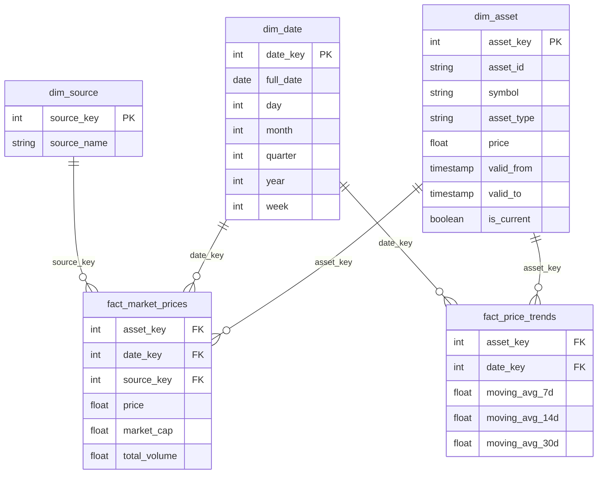

# Crypto Market Analysis Platform

> End-to-end ELT data engineering platform for collecting, transforming and analyzing cryptocurrency and stock market data using Apache Airflow, dbt and PostgreSQL.


---

#  Project Overview

The Crypto Market Analysis Platform is an automated ELT (Extract–Load–Transform) pipeline designed for collecting, processing and analyzing cryptocurrency and stock market data.

The platform integrates multiple financial APIs, stores raw market data inside PostgreSQL and transforms it into a dimensional data warehouse using dbt. Apache Airflow orchestrates the complete workflow, while Docker provides an isolated and reproducible execution environment.

The main objective of the project is to build a scalable analytics platform capable of supporting Business Intelligence dashboards and historical market analysis.

---

#  Project Goals

The platform was designed to:

- Automate financial market data collection
- Build a modern ELT pipeline
- Transform raw API data into analytical datasets
- Track historical dimensional changes using SCD Type 2
- Support incremental daily data ingestion
- Prepare clean datasets for Business Intelligence tools

---

#  System Architecture

```text
                  +--------------------+
                  |    CoinGecko API   |
                  +--------------------+
                             |
                  +--------------------+
                  |    Binance API     |
                  +--------------------+
                             |
                  +--------------------+
                  | Alpha Vantage API  |
                  +--------------------+
                             |
                             ▼
                  Apache Airflow DAG
                  (Pipeline Orchestration)
                             │
                             ▼
                  PostgreSQL Raw Layer
                             │
                             ▼
                   dbt Staging Models
                             │
                             ▼
                dbt Intermediate Models
                             │
                             ▼
                   dbt Marts (Star Schema)
                             │
                             ▼
                   Analytics / BI Layer
```

---

#  Tech Stack

| Technology | Purpose |
|------------|---------|
| Python | Data ingestion |
| PostgreSQL | Data Warehouse |
| Apache Airflow | Workflow orchestration |
| dbt | Data transformations |
| Docker | Containerization |
| SQL | Data modelling |
| Git | Version Control |
| GitHub | Source Code Management |

---

#  Data Sources

The platform integrates data from three independent financial APIs.

##  CoinGecko

Cryptocurrency market data.

Collected information:

- Asset Symbol
- Daily Price
- Market Capitalization
- Total Trading Volume

Supported assets:

- Bitcoin (BTC)
- Ethereum (ETH)
- Solana (SOL)
- Cardano (ADA)
- Binance Coin (BNB)

---

##  Binance

Daily market trading information.

Collected information:

- Open Price
- High Price
- Low Price
- Close Price
- Volume
- Quote Volume
- Price Change
- Price Change Percentage

---

##  Alpha Vantage

Stock market information.

Collected information:

- Open
- High
- Low
- Close
- Volume

Current implementation includes:

- Tesla (TSLA)

---

#  ELT Pipeline

The project follows the ELT (Extract → Load → Transform) approach.

Unlike traditional ETL systems, data is first loaded into PostgreSQL and then transformed using dbt.

## Initial Load

During the first execution the pipeline performs a **Full Load**.

Historical market data is downloaded from all APIs in order to initialize the warehouse.

This creates the initial datasets required for analytical models.

---

## Incremental Load

After the warehouse has been initialized, the pipeline switches to **Incremental Loading**.

Instead of downloading historical data again, only newly available market data is collected.

Benefits:

- Reduced API usage
- Faster execution
- Lower storage requirements
- Efficient daily updates

The Airflow scheduler executes the pipeline automatically according to the configured schedule.
#  Data Warehouse Architecture

The data warehouse follows a layered ELT architecture, where each layer has a dedicated responsibility within the transformation pipeline.

```text
                    APIs
                     │
                     ▼
              Raw Data Layer
                     │
                     ▼
              Staging Layer
                     │
                     ▼
           Intermediate Layer
                     │
                     ▼
               Marts Layer
                     │
                     ▼
             Business Intelligence
```

Each layer is designed to perform a specific task, making the pipeline modular, maintainable and scalable.

---

#  Raw Layer

The Raw layer is the landing zone for all incoming API data.

This layer stores the original source data with minimal or no transformations applied.

Responsibilities:

- Store original API responses
- Preserve source data
- Support reproducibility
- Enable incremental ingestion
- Serve as the source for dbt transformations

The raw layer represents the **single source of truth** for the entire warehouse.

---

## Raw Tables

| Table | Description |
|--------|-------------|
| raw_coingecko | Cryptocurrency daily market data |
| raw_binance | Binance daily trading metrics |
| raw_alpha_vantage | Stock market daily prices |

---

#  Staging Layer

The staging layer is implemented using **dbt Views**.

Unlike physical tables, staging models do not store data permanently.

Instead, they provide standardized and cleaned views over the raw data.

Responsibilities:

- Rename columns
- Standardize naming conventions
- Convert data types
- Basic cleaning
- Remove unnecessary columns
- Prepare consistent datasets

Current staging models:

| Model | Purpose |
|--------|----------|
| stg_coingecko | Cleans CoinGecko data |
| stg_binance | Cleans Binance data |
| stg_alpha_vantage | Cleans Alpha Vantage data |

Since the staging models are materialized as **views**, they always reflect the latest available data stored in the raw layer.

---

#  Intermediate Layer

The intermediate layer contains reusable business logic.

Instead of creating complex SQL inside the marts layer, transformations are split into smaller reusable models.

Responsibilities:

- Combine datasets
- Perform calculations
- Create reusable business logic
- Prepare analytical datasets

Implemented models include:

### crypto_unified

Combines CoinGecko and Binance datasets into a unified cryptocurrency dataset.

This model standardizes:

- symbol
- date
- price
- market capitalization
- trading volume
- data source

---

### binance_metrics

Calculates additional Binance indicators such as:

- price change
- percentage change
- volatility labels
- quote volume

These metrics are later used inside analytical reports.

---

#  Marts Layer

The marts layer represents the final analytical warehouse.

It follows a **Star Schema** design.

The marts layer contains:

- Dimension tables
- Fact tables
- Reporting models

This layer is optimized for analytical queries and Business Intelligence dashboards.

---

#  Star Schema



---

# Dimension Tables

## dim_asset

The Asset Dimension stores descriptive information about financial assets.

Columns:

- asset_key (Surrogate Key)
- asset_id
- symbol
- asset_type
- price
- valid_from
- valid_to
- is_current

This dimension implements **Slowly Changing Dimension Type 2**, allowing historical tracking of price changes over time.

---

## dim_date

The Date Dimension contains calendar information used by fact tables.

Columns include:

- date_key
- full_date
- day
- month
- quarter
- year
- week

Using a dedicated date dimension improves reporting performance and simplifies time-based analysis.

---

## dim_source

Stores information about the origin of the data.

Supported sources:

- CoinGecko
- Binance
- Alpha Vantage

---

#  Fact Tables

## fact_market_prices

Stores daily market metrics for each asset.

Measures:

- price
- market_cap
- total_volume

Foreign Keys:

- asset_key
- date_key
- source_key

This table is used for historical price analysis and market reporting.

---

## fact_price_trends

Stores calculated technical indicators.

Measures:

- 7-Day Moving Average
- 14-Day Moving Average
- 30-Day Moving Average

This table supports trend analysis and visualization.

---

#  Database Structure

The PostgreSQL warehouse is organized into multiple schemas.

| Schema | Purpose |
|---------|---------|
| public_raw | Raw API data |
| public_staging | Cleaned staging models |
| public_intermediate | Business transformations |
| public_marts | Final analytical models |

This separation improves maintainability, simplifies debugging and keeps transformations organized according to the ELT architecture.

#  Slowly Changing Dimension (SCD Type 2)

The **dim_asset** dimension implements **Slowly Changing Dimension Type 2 (SCD Type 2)** in order to preserve the complete history of asset changes.

Unlike a traditional update, historical records are never overwritten.

Instead, whenever an attribute changes (currently the **asset price**), a new version of the record is inserted while the previous version is marked as inactive.

## Implementation

The following columns are used for versioning:

| Column | Description |
|----------|-------------|
| valid_from | Timestamp when the record became active |
| valid_to | Timestamp when the record expired |
| is_current | Indicates the currently active version |

When a price change is detected:

Previous record:

```text
valid_to = current_timestamp
is_current = false
```

New record:

```text
valid_from = current_timestamp
valid_to = NULL
is_current = true
```

This approach enables historical reporting while preserving previous versions of each asset.

---

#  Apache Airflow

Apache Airflow orchestrates the complete ELT workflow.

The pipeline is executed as a Directed Acyclic Graph (DAG).

Pipeline steps:

```text
Data Ingestion
        │
        ▼
dbt Run
        │
        ▼
dbt Test
```

Responsibilities:

- Execute ingestion scripts
- Schedule daily execution
- Monitor pipeline status
- Trigger dbt transformations
- Validate warehouse quality

Example DAG:

```text
run_ingestion
        │
        ▼
run_dbt_models
        │
        ▼
run_dbt_tests
```

> **Screenshot**

```md

```

---

#  dbt Transformations

dbt is responsible for transforming raw data into analytical models.

Implemented transformation layers:

```text
Raw
    │
    ▼
Staging
    │
    ▼
Intermediate
    │
    ▼
Marts
```

dbt provides:

- Modular SQL models
- Incremental processing
- Dependency management
- Automated testing
- Documentation generation

The project also uses dbt lineage to visualize model dependencies.

> **Screenshot**

```md

```

---

#  Data Quality

The warehouse includes automated dbt tests to ensure data integrity.

Implemented tests:

## Unique

Ensures surrogate keys are unique.

Examples:

- asset_key
- date_key
- source_key

---

## Not Null

Guarantees required columns are populated.

Examples:

- price
- asset_type
- source_name

---

## Relationships

Verifies foreign key integrity between dimensions and facts.

Examples:

- asset_key
- date_key
- source_key

---

## Accepted Values

Validates categorical values.

Example:

```text
is_current

Allowed values:

true
false
```

---

#  Project Structure

```text
crypto-analysis-platform
│
├── airflow
│   ├── dags
│   ├── logs
│   └── plugins
│
├── dbt
│   └── my_dbt_project
│       │
│       ├── models
│       │   ├── staging
│       │   ├── intermediate
│       │   └── marts
│       │
│       ├── macros
│       ├── tests
│       ├── analyses
│       ├── snapshots
│       └── dbt_project.yml
│
├── config.py
├── ingest.py
├── docker-compose.yml
├── Dockerfile
├── requirements.txt
└── README.md
```

---

#  Quick Start

## Clone Repository

```bash
git clone https://github.com/<username>/crypto-analysis-platform.git

cd crypto-analysis-platform
```

---

## Start Docker

```bash
docker compose up -d
```

---

## Run Airflow

```text
http://localhost:8080
```

---

## Run dbt Models

```bash
cd dbt/my_dbt_project

dbt run
```

---

## Execute Tests

```bash
dbt test
```

---

## Generate Documentation

```bash
dbt docs generate

dbt docs serve
```

---

#  Features Implemented

✔ Multi-source API ingestion

✔ Dockerized infrastructure

✔ PostgreSQL Data Warehouse

✔ Apache Airflow orchestration

✔ dbt transformations

✔ Incremental ELT pipeline

✔ Layered architecture

✔ Star Schema

✔ Slowly Changing Dimension Type 2

✔ Historical versioning

✔ Moving Average calculations

✔ Volatility metrics

✔ Data Quality validation

✔ Reporting models

---

#  Future Improvements

The following features are planned for future versions:

- Power BI dashboards
- Airbyte connectors
- CI/CD pipeline
- Automated deployment
- Data freshness tests
- Pipeline monitoring
- Alerting
- Unit testing
- Additional financial APIs
- Advanced analytical reports

---

